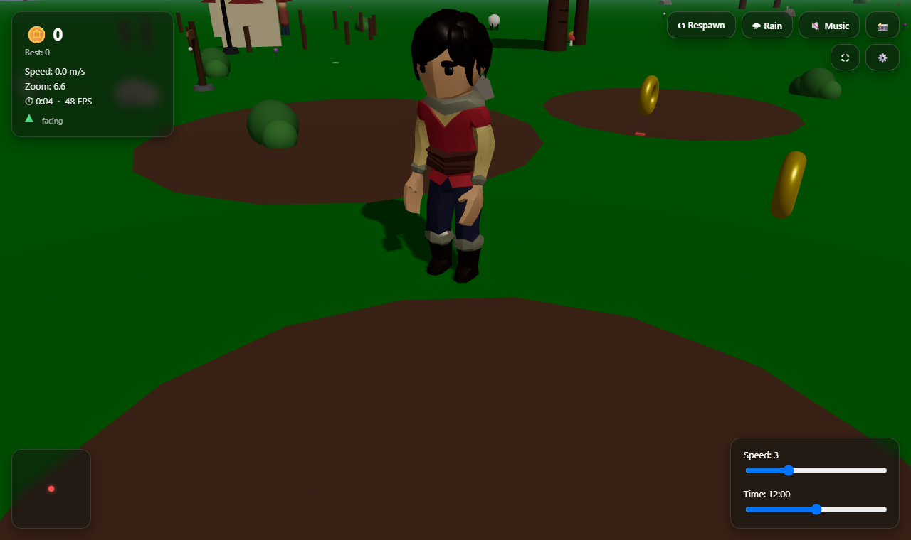
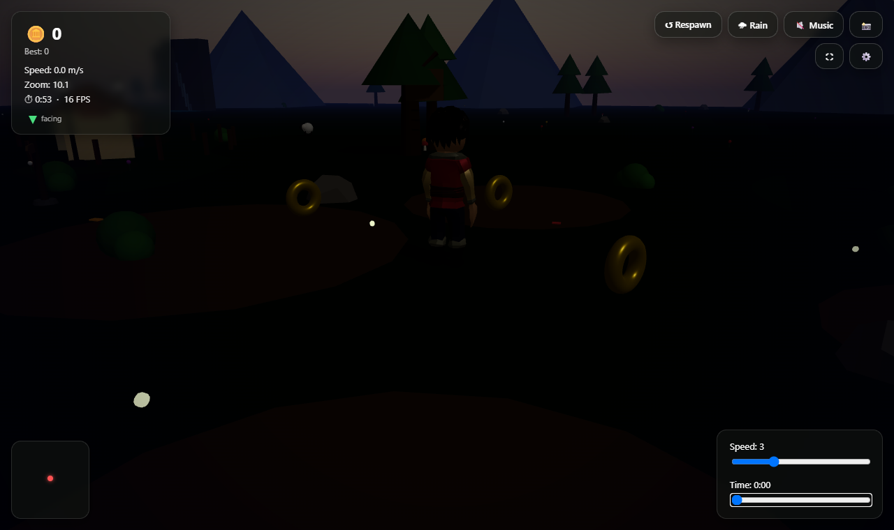
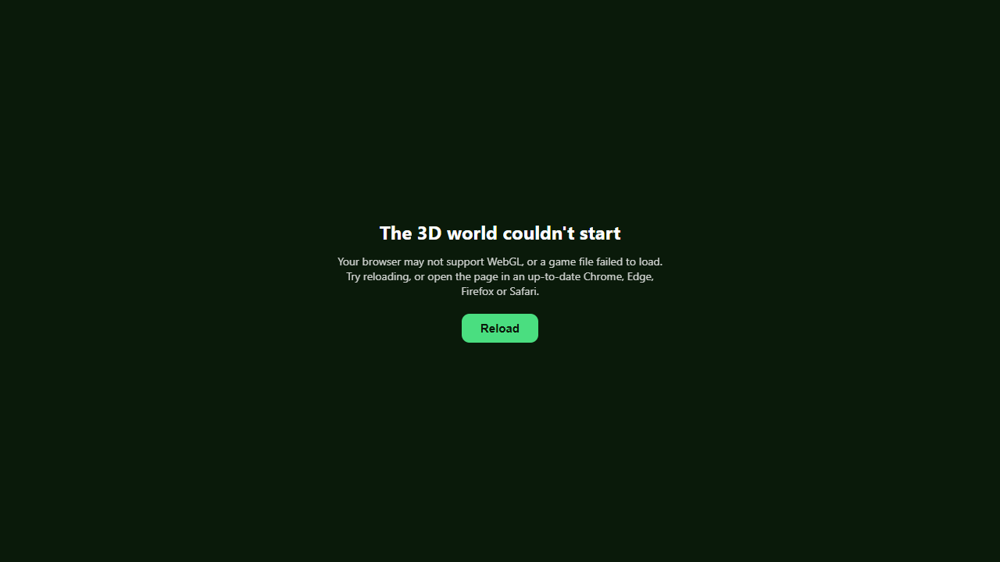

# My First 3D World: Usage and Debugging Guide

A browser game built with React, Three.js (via React Three Fiber) and Vite. You control a character in a small 3D village: run, jump, collect coins, and watch the day turn to night. This guide covers running it, how it is put together, how to change it, and how to debug it.

**Stack:** React 19, three 0.185, @react-three/fiber 9.7, @react-three/drei 10.7, Vite 8. Node `^20.19` or `>=22.12` is required.

---

## 1. Quick start

| Task | Command |
|---|---|
| Install dependencies | `npm install` |
| Dev server with hot reload | `npm run dev` (http://localhost:5173) |
| Lint | `npm run lint` (must report nothing) |
| Production build | `npm run build` (output in `dist/`) |
| Preview the production build | `npm run preview` (http://localhost:4173) |
| Browser smoke test | see section 7 |

**Before every release:** `npm run lint`, then `npm run build`, then run the smoke test against `npm run preview`. All three must be clean.

## 2. Controls and gameplay





| Input | Action |
|---|---|
| W A S D or arrow keys | Move |
| Space | Jump (press again in mid-air for a double jump) |
| Shift | Sprint (1.8x speed, leaves a blue trail) |
| Esc | Pause and resume (also stops the play timer) |
| Mouse drag / wheel | Orbit and zoom the camera (distance 2 to 40) |
| Touch devices | On-screen joystick and JUMP button appear automatically |

- **Goal:** collect all 6 pickups (5 coins worth 1 point, 1 star worth 5). Collecting the last one shows *Level Complete* with fireworks.
- **Combo:** coins collected within 2 seconds of each other build a streak. From a streak of 3 you get a bonus of `floor(streak / 3)` extra points per pickup.
- **Star:** turns on a 5-second magnet that pulls coins within 10 metres toward you.
- **HUD buttons:** Respawn (resets position, coins, score), Rain, Music, Screenshot (downloads a PNG), Fullscreen, Settings (dust, camera shake, fog).
- **Sliders:** walking speed (1 to 8) and time of day (0 to 24). Night brings stars, fireflies, glowing lamp posts and a darker vignette.
- The pond at the east side slows nothing but tints the screen blue while you stand in it.

**Saved in the browser (localStorage):** `highScore`, `baseSpeed`, `dustEnabled`, `shakeEnabled`, `fogEnabled`, `musicOn`. Clear them in DevTools > Application > Local Storage to reset. If storage is blocked (private mode), the game still works and just does not remember.

## 3. Project layout

```
index.html              page shell, title, meta tags
vite.config.js          build config and vendor chunk splitting
eslint.config.js        lint rules (ignores dist and .kilo)
public/
  favicon.svg
  models/child.glb      the character (rigged, has Idle and Run animations)
scripts/smoke_test.py   browser smoke test (Playwright)
src/
  main.jsx              React entry point (StrictMode)
  App.jsx               HUD, settings, score, audio, all UI state
  index.css             full-screen canvas reset
  hooks/
    inputState.js       shared mutable input object (keyboard + touch write to it)
    useKeyboardControls.js   key listeners, focus and blur handling
  world/
    layout.js           positions and collision circles of every static object
    random.js           seeded random generator (same seed = same world)
  components/
    Scene.jsx           <Canvas>, lighting, camera, coins, collisions, day/night
    ErrorBoundary.jsx   friendly screen if the 3D scene fails to start
    Character.jsx       model, animation, movement, jumping, squash on landing
    ... one file per world object (see section 4)
```

## 4. Architecture

### 4.1 Data flow

`App.jsx` owns all UI and game state (score, time of day, rain, settings). It renders `<Scene>` and passes values down as props. `Scene` reports back through callbacks (`onScoreChange`, `onFpsChange`, `onPositionChange` and so on).

- `Scene` is wrapped in `React.memo`. **Every callback passed to it from `App` must be stable** (a `useCallback` or a state setter). An inline arrow function such as `onScoreReset={() => setScore(0)}` breaks the memo and re-renders the whole 3D tree on every HUD update.
- Anything that changes every frame (positions, particles, animation) must **not** go through React state. Use a `ref` and mutate it inside `useFrame`. Only throttled values (speed, FPS, position every 0.15 s) are pushed to state for the HUD.

### 4.2 Input

Keyboard and touch both write to the shared `inputState` object in `hooks/inputState.js`. `Character`, `Dust` and `SprintTrail` read it every frame. `useKeyboardControls` also:
- clears all input when the window loses focus (otherwise alt-tab leaves the character running),
- blurs any focused button or slider when a movement key is pressed (otherwise Space presses the last clicked button and arrows move the sliders).

### 4.3 World layout and collisions

`src/world/layout.js` is the single source of truth for where things are. It exports positions, the pond centre and radius, and the `colliders` array. Each collider is `{ position: [x, y, z], radius }`. `ObstacleManager` in `Scene.jsx` pushes the character out of every collider each frame using circle-versus-circle checks on the ground plane.

Trees, rocks, bushes, flowers, mushrooms, leaves and stars are generated from fixed seeds (`world/random.js`), so the world looks the same on every load.

### 4.4 Components

| Component | What it does |
|---|---|
| Scene | Canvas, lights, fog, sky, orbit camera rig, coin manager, collision manager, pond trigger, screenshot and FPS helpers |
| Character | Loads `child.glb`, recolours materials, plays Idle/Run, moves, jumps (double jump), squashes on landing |
| Coin | Spinning bobbing coin or star pickup |
| Trees, Landmarks (rocks, bushes), Flora, Mushrooms | Scenery, seeded placement |
| Village (houses, fence), Barn, Windmill, Well, Treehouse, Scarecrow, LampPosts, Signposts, Bridge, Dock, Pond, Waterfall, CropField, SoilPatches, Mountains | Static structures |
| Sheep, Chickens, Villager, Fish, Birds, Butterflies, Beehive, TireSwing | Animated life, moved by sine paths in `useFrame` |
| Clouds, Stars, HotAirBalloon, Campfire, Fireflies, Leaves, Rain | Atmosphere and effects |
| Dust, SprintTrail, Sparkles, Fireworks | Pooled particle effects (fixed pool of meshes, reused) |
| TouchJoystick | Mobile controls, shown only on touch devices |
| ErrorBoundary | Fallback screen with a Reload button |

### 4.5 Day and night

`timeOfDay` (0 to 24, default 12) is turned into a sun angle in `getTimeOfDayValues` (`Scene.jsx`). It drives sun position, light intensity, fog and ground colour, and the `nightIntensity` used by Stars and the vignette. `isNightTime` switches on fireflies and lamp posts.

## 5. Common changes

**Add a static object with collision**
1. Add its position constant and a `{ position, radius }` entry to `colliders` in `world/layout.js`.
2. Create `components/MyThing.jsx` that imports the position from `layout.js`.
3. Import and render `<MyThing />` in `Scene.jsx`.

**Add a coin:** add an entry to `initialCoins` in `Scene.jsx` (`type: 'coin'` or `'star'`). The "coins left" count and the level-complete screen adapt automatically.

**Add an animated effect:** copy a small component such as `Butterflies.jsx`. Keep motion inside `useFrame` and never call `setState` there.

**Tune gameplay:** constants sit at the top of the file that uses them: `GRAVITY`, `JUMP_STRENGTH` in `Character.jsx`; `COMBO_WINDOW_MS`, `MAGNET_RADIUS`, `MAGNET_PULL_SPEED`, `MAGNET_DURATION_MS`, `AUTO_FOLLOW_DELAY_MS` in `Scene.jsx`.

**Replace the character:** replace `public/models/child.glb`. The code expects animations named `Idle` and `Run`, materials named Shirt, UnderShirt, Pants, Boots, Hair, Skin (recoloured in `Character.jsx`), and bones named `Head`, `UpperLeg.L/R`, `LowerLeg.L/R`.

## 6. Deployment

`npm run build` produces a static site in `dist/`. Any static host works (Netlify, Vercel, GitHub Pages, S3, nginx). No server code or environment variables are needed.

- **Hosting under a sub-path** (for example `https://user.github.io/my-app/`): set `base: '/my-app/'` in `vite.config.js`. The model URL already follows `import.meta.env.BASE_URL`.
- **Caching:** files in `dist/assets/` have content hashes, so they can be cached for a year. Keep `index.html` on a short cache. The vendor chunks (`three`, `react-three`, `react`) rarely change, so returning visitors only re-download the small app chunk.
- **Compression:** enable gzip or brotli on the host. Total transfer is about 340 kB gzipped plus the 660 kB model.
- **Requirements for players:** a browser with WebGL 2 (current Chrome, Edge, Firefox, Safari). If WebGL fails, the error screen appears.

Current bundle (gzipped): app 17 kB, react 56 kB, react-three 82 kB, three 185 kB.

## 7. Testing

The automated check is `scripts/smoke_test.py`. It runs the production build in headless Chromium and verifies 15 things: title, canvas loads, movement speed, focus handling for Space and arrow keys, pause and timer, night mode, respawn, coin pickup and toast, FPS counter, the error screen when the model is blocked, and no console errors.

```
npm run build
npx vite preview --port 4173          # leave running in a second terminal
pip install playwright
python -m playwright install chromium
python scripts/smoke_test.py          # screenshots go to smoke-screenshots/
```

It exits with code 1 on any failure, so it can run in CI. Headless mode uses software rendering, so FPS is in single digits during the test; that is expected and not a bug.

Manual pass on a real device before release: play a full level on a phone (joystick and JUMP), toggle Rain and Time, leave the tab in the background and return, and confirm 60 FPS on a normal laptop.

## 8. Debugging guide

### 8.1 First steps
1. Open DevTools (F12) > Console. Real errors are red. The only expected warning is `THREE.Clock has been deprecated`, which comes from a library dependency and is harmless.
2. Reproduce with `npm run build` + `npm run preview`, not only `npm run dev`. Some bugs only appear in the minified build.
3. Run `npm run lint`. The React Compiler rules catch impure renders (`Math.random()` during render) and ref misuse.

### 8.2 Symptom table

What players see when the scene cannot start (here the model file was blocked):



| Symptom | Likely cause and fix |
|---|---|
| "The 3D world couldn't start" screen | Console shows `[3D world] Scene failed to render` with the real error. Usually WebGL disabled/unsupported (check chrome://gpu), or `public/models/child.glb` missing or not served (check the Network tab for a 404). |
| Blank page, no error screen | Error thrown outside the boundary (in `App.jsx` or `main.jsx`). Read the Console. |
| Stuck on "Loading world..." | Model request pending or failed. Network tab > `child.glb`. Check `base` in `vite.config.js` if deployed under a sub-path. |
| Character does not move | Click the canvas once to give the page focus. Check `inputState` in the console. If a key seems stuck, press and release it. |
| Character walks through an object | It has no entry in `colliders` in `world/layout.js`, or its `radius` is too small. |
| Character stops against something invisible | A collider exists where nothing renders. Compare the position in `layout.js` with the component. |
| Whole scene stutters when moving | Something pushes per-frame data into React state, or a callback prop given to `Scene` is unstable. Check with React DevTools Profiler: `Scene` should not re-render on every frame. |
| Low FPS | Try Settings > Fog off, Dust off. Shadow map is 2048 (in `Scene.jsx`); lower it to 1024. Many `pointLight`s are expensive (6 lamps + campfire). |
| Score wrong or coin counted twice | `handleCollect` in `Scene.jsx` guards with `collectedIds`. Check it is reset in the respawn effect. |
| Rain, Music or Time buttons "click themselves" on Space | Focus handling in `useKeyboardControls.js` was removed or bypassed. |
| Music and footsteps are silent | Expected: all audio uses a silent placeholder WAV (`MUSIC_DATA`, `WIND_DATA`, `COIN_SOUND_DATA`). Replace the data URIs with real files placed in `public/`. |
| Settings not remembered | localStorage blocked. The game works without it. |
| Screenshot button downloads a black image | Some browsers clear the WebGL buffer. The handler renders once before capture; if it still fails, add `gl={{ preserveDrawingBuffer: true }}` to `<Canvas>`. |
| `THREE.Color: Invalid hex color` warning | A color string is not 3 or 6 hex digits. Search for the value in `src/components`. |
| Lint error `Cannot access refs during render` | A ref's `.current` is read in JSX. Read it in `useFrame` or an effect, or lazily create with `if (ref.current === null) ref.current = create()`. |
| Lint error `Cannot call impure function during render` | `Math.random()` or `Date.now()` inside a component body. Use constants, `seededRandom`, or compute inside `useFrame`. |

### 8.3 Useful techniques
- **Find where an object lives:** its position constant is in `world/layout.js` (static objects) or at the top of its component (animated ones).
- **See colliders:** temporarily render a red `<mesh>` at each `colliders` entry inside `Scene` with `<cylinderGeometry args={[c.radius, c.radius, 0.1, 16]} />`.
- **Watch input:** in the console, import is not exposed; temporarily add `window.inputState = inputState` in `useKeyboardControls.js`.
- **Freeze time:** drag the Time slider; the sun, fog and ground respond instantly.
- **Profile:** Chrome DevTools > Performance for CPU; `renderer.info` (`gl.info.render.calls`) for draw calls.

### 8.4 Known limitations
- Audio is placeholder only (silent).
- Every scene object is its own mesh (not measured, but likely hundreds of draw calls; check `gl.info.render.calls`). Merging trees, flowers and fence posts with `InstancedMesh` is the best future performance win if low-end devices matter.
- Collision is 2D circles on the ground. There is no walking on the bridge, dock, or treehouse.
- The minimap is a plain panel with a moving dot and no terrain.
- `THREE.Clock` deprecation warning comes from @react-three/fiber 9.7 and will disappear when the library updates.

## 9. Change log of this release

Fixed while preparing for production:
- **Broken import:** `Scene.jsx` imported `./Stars` but the file was named `Stats.jsx` (rename now committed).
- **Crash on start:** the character's animation code could run before the Idle animation was ready (`Cannot read properties of null (reading 'fadeOut')`).
- **FPS shown as NaN** after a zero-length frame; the walking speed readout is now computed from real elapsed time.
- **Input:** window blur no longer leaves the character running; Space and arrows no longer trigger the last clicked button or slider.
- **Play timer** now stops on pause and on level complete, and resets on respawn.
- **Coin collection** can no longer double count; the star magnet now does one state update per frame instead of one per coin.
- **Purity:** removed `Math.random()` and ref reads during render (scarecrow straw, chickens, rain, leaves, fireworks); lint is now clean (it reported 46 problems).
- **Windmill axle and chicken beak** were mis-rotated (rotation was set on the geometry, where it is ignored).
- **Invalid color** `#79706280` in the waterfall.
- **Robustness:** localStorage failures are handled, audio elements are cleaned up, error boundary added, model path respects the deploy base path and is preloaded.
- **Structure:** collider data centralised in `world/layout.js`, the duplicated `seededRandom` (7 copies) moved to `world/random.js`.
- **Build:** vendor code split into cached chunks (one 1.23 MB file became 4 files; app code is 68 kB), page title and meta tags set, `.kilo` worktrees excluded from lint.
